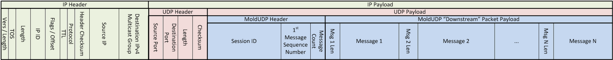

# MoldUPD64

This project contains the code for the RTL implementation of a MoldUPD64 receiver
as well as a small test bench.

This is designed as part of a larger NASDAQ HFT hardware project.

Note : The current implementation applies backpressure stalling the axi stream input
    data for 1 cycle at a time. The plan is to remove this in the second version of the
    mold module.

## Packet view

This code takes as input an AXI stream of the UPD payload and decapsulates the
multiple MoldUDP messages.



## Interface 

Top level module, moldudp64 interface :
```
module moldudp64 #(

	parameter AXI_DATA_W  = 64,
	parameter AXI_KEEP_W  = 8,
	parameter SID_W       = 80,
	parameter SEQ_NUM_W   = 64,
	`ifdef DEBUG_ID
	parameter DEBUG_ID_W  = SID_W + SEQ_NUM_W,
	`endif	
	`ifdef NUKE
	parameter NUKE_ID_W   = 10,
	`endif	
	parameter ML_W        = 16, // Mold length field width in bits
	parameter EOS_MSG_CNT = {ML_W{1'b1}},// end-of-session msg cnt value

	// overlap fields
	parameter OV_DATA_W  = 64-ML_W,//48
	parameter OV_KEEP_W  = (OV_DATA_W/8),//6
	parameter OV_KEEP_LW = 3 //$clog2(OV_KEEP_W+1),
)(
	input clk,
	input nreset,
	
	// AXI stream interface from udp ethernet
	input                  udp_axis_tvalid_i,
	input [AXI_KEEP_W-1:0] udp_axis_tkeep_i,
	input [AXI_DATA_W-1:0] udp_axis_tdata_i,
	input                  udp_axis_tlast_i,
	input                  udp_axis_tuser_i,
	
	output                 udp_axis_tready_o,

	`ifdef MISS_DET
	// missing mold message detection

	// missing sequence numbers of the same sid
	output logic                 miss_seq_num_v_o,
	output logic [SID_W-1:0]     miss_seq_num_sid_o,
	output logic [SEQ_NUM_W-1:0] miss_seq_num_start_o,	
	output logic [SEQ_NUM_W-1:0] miss_seq_num_cnt_o,
	// missing entire session's
	output logic                 miss_sid_v_o,
	output logic [SID_W-1:0]     miss_sid_start_o,
	output logic [SEQ_NUM_W-1:0] miss_sid_seq_num_start_o,
	output logic [SID_W-1:0]     miss_sid_cnt_o,
	output logic [SEQ_NUM_W-1:0] miss_sid_seq_num_end_o,	
	`endif // MISS_DET	
	
	`ifdef HEARTBEAT
	output logic            flatlined_v_o,
	`endif

	`ifdef MOLD_MSG_IDS	
	output [SID_W-1:0]      mold_msg_sid_o,
	output [SEQ_NUM_W-1:0]  mold_msg_seq_num_o,
	`endif
	`ifdef DEBUG_ID
	// no input debug id as it is constructed out of the seq
	// and sid numbers
	output [DEBUG_ID_W-1:0]  mold_msg_debug_id_o,
	`endif
	output                   mold_msg_v_o,
	output                   mold_msg_start_o
,	output [AXI_KEEP_LW-1:0] mold_msg_len_o,
	output [AXI_DATA_W-1:0]  mold_msg_data_o, 

	// overlap
	output                   mold_msg_ov_v_o,
	output [OV_KEEP_LW-1:0]  mold_msg_ov_len_o,
	output [OV_DATA_W-1:0]   mold_msg_ov_data_o
);
```

### UDP AXI stream 

This module accepts UDP packets via an AXI stream interface, this module
is the slave. 

Input : 

- `upd_axis_tvalid_i` : indicates that the master is driving a valid transfer.
    A transfer takes place when both `tvalid` and `tready` are asserted.

- `upd_axis_tkeep_i` : is the byte qualifier that indicates whether the content
    of the associated byte of `tdata` is processed as part of the data stream.
    Associated bytes that have the `tkeep` byte qualifier deasserted
    are null bytes and can be removed from the data stream.

- `upd_axis_tdata_i` : is the primary payload that is used to provide the data
    that is passing across the interface. 

- `udp_axis_tlast_i` : indicates the boundary of a packet. / End-of-frame

- `udp_axis_tuser_i` : user defined / Bad frame (valid with `tlast` & `tvalid`)

Output :

- `tready` : indicates that the slave can accept a transfer in the
    current cycle. 

### ( Optional ) Missing message detection

When `MISS_DET` is defined the logic to detect missing messages is 
included. This is needed to build re-request logic for requesting replay
of missing messages to the UDP replay server.

There are two parts to this output :

Detecting missing messages based on there sequence numbers within 
the same session:

- `miss_seq_num_v_o` : validity bit, indicates we have detected a missing
    sequence number.

- `miss_seq_num_sid_o` : session id for the missing sequence.

- `miss_seq_num_start_o` : start id of the missing sequence.

- `miss_seq_num_cnt_o` : number of missing messages.

Detecting missing group of messages based on there session id and sequence
number, this necessarily spans over multiple sessions:

- `miss_sid_v_o` : validity bit, indicates we have detected messages spanning
    over multiple missing sessions.

- `miss_sid_start_o` : start session id for the missing sessions.

- `miss_sid_seq_num_start_o` : start sequence id for the missing sessions.

- `miss_sid_cnt_o` : number of missing sessions.

- `miss_sid_seq_num_end_o` : end sequence id for the missing sessions.

### ( Optional ) Detect server liveness

When `HEARTBEAT` is defined the logic to count down since the last
server message was received is included, The moldudp64 documentation
defines that the UDP server is expected to send one new message every 
second, When this fails to occur we can assume that the connection to
the server was broken.

- `flatlined_v_o` : validity bit indicating we haven't received a new
    message from the server within the expected time, connection has
    been broken.

### ( Optional ) Current message session and sequence id

When `MOLD_MSG_IDS` is defined the logic to expose the latest's
message's sequence number and session id is exposed on the interface.

- `mold_msg_sid_o` : latest message session id.

- `mold_msg_seq_num_o` : latest message sequence number.

### ( Optional ) Debug message id

When `DEBUG_ID` is defined the logic to output a unique id associated
to each message is included. This is used in the top level test bench
to track itch messages through the system and detect corruption or
lost messages.

This debug id has `mold_msg_v_o` as it's validity bit.

- `mold_msg_debug_id_o` : unique session id used for debug associated to
    the latest message.

### Mold message

Extracted mold message contained in the mold packet.
This message data is driven in order and aligned on 8 bytes
with no bubbles in the data. 

This is to be connected to the itch decoder.


- `mold_msg_v_o` : validity bit, indicates we have a valid part of a
    mold message.

- `mold_msg_start_o` : currently the of a new mold message.

- `mold_msg_len_o` : is the length in bytes of the valid data on `mold_msg_data_o`.

- `mold_msg_data_o` : 8 byte aligned mold message data.
 
### Overlap mold message data

We define an overlap as the case where the end of a mold message and the first part of 
a new mold message's data are present on the same AXI payload. The new message's data bytes
will be transfered on these overlap signals.
[More information](https://github.com/Essenceia/ITCH#example)

- `mold_msg_ov_v_o` : validity bit, overlap data present.

- `mold_msg_ov_len_o` : length in bytes of the data.

- `mold_msg_ov_data_o` : overlap message data, 6 byte aligned

## Limitations

- Mold messages must be at least 6 bytes long.

## Assumptions 

- Next expected session id will only be incremented when an End-of-Sequence 
  packet is received or if the current packet's session id is greater than the
  internal value, but not by sequence counter overflow.

## Test bench

This repository contains a small test bench, a more complete test bench is
available at the top level.

Run test :
```
make run
```

( Optional ) Run with `DEBUG` and `DEBUG_ID` macro defined :
```
make run debug=1
```

Clean :
```
make clean
```

### Debug id

When the `DEBUG_ID` macro is defined the `moldudp64` module output an
`debug_id_o` alongside each message. This signal is used to help 
track each message individually for debug.

This id is created by combining the session id and the sequence number.

By default the `DEBUG_ID` macro is not defined.

## License

This code is licensed under CC BY-NC 4.0, to obtain a commercial license
reach out to the author .
